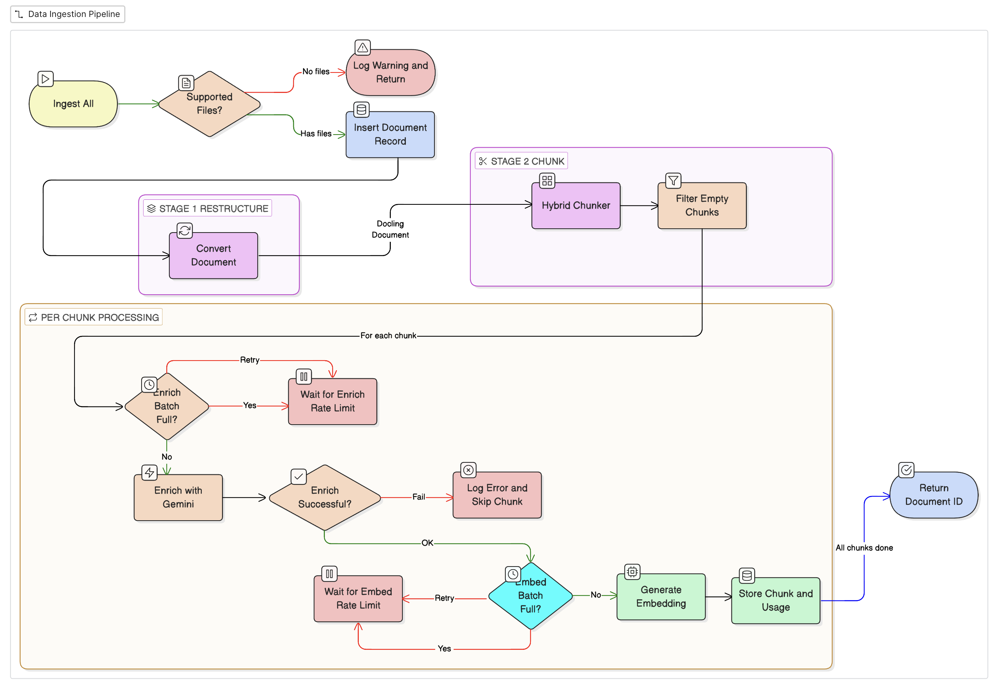

# Data Ingestion Pipeline - Docling + Enriched Metadata

## Overview

This system ingests PDF, DOCX, and HTML documents into a vector database for semantic retrieval. Each document is parsed, chunked, enriched with LLM-generated metadata, embedded, and stored in NeonDB (PostgreSQL + pgvector). The pipeline is designed for offline batch ingestion with rate-limit-aware batching against the Gemini API.


---

## Repository Layout

```
.
├── clients.py              # Singleton clients: GeminiClient, DBClient
├── data_ingestion_pipeline.py  # Core pipeline: restructure → chunk → enrich → store
├── init_schema.py          # One-shot DB schema initializer
├── schema.sql              # PostgreSQL schema (tables + indexes)
├── test_db.py              # DB connectivity smoke test
├── test_gemini.py          # Gemini API smoke test
└── data/                   # Input documents (PDF, DOCX, HTML)
```

---

## Components

### `clients.py`

Provides two thread-safe singletons via double-checked locking.

**`GeminiClient`**
- `generate(prompt, json_mode)` — calls `gemini-*` generative model; returns `(text, usage)`
- `embed(text, task_type)` — calls `gemini-embedding-001` at 1536 dims; returns `(vector, usage)`
- `json_mode=True` sets `response_mime_type: application/json` for structured outputs
- `task_type` should be `RETRIEVAL_DOCUMENT` during ingestion, `RETRIEVAL_QUERY` at search time

**`DBClient`**
- Wraps a single `psycopg2` connection to NeonDB
- `conn` property probes with `SELECT 1` on every access to handle Neon's ~5 min suspend/reconnect behaviour
- All cursors use `RealDictCursor` — rows are always returned as dicts
- Exposes `cursor()`, `commit()`, `rollback()`, `close()`

---

### `data_ingestion_pipeline.py`

Orchestrates the four-stage pipeline.

#### Stage 1 — Restructure (`restructure`)
- Uses `docling.DocumentConverter` to parse raw files into a structured `DoclingDocument`
- Handles PDF, DOCX, HTML natively
- Output: a `DoclingDocument` with text elements, tables, code blocks etc.

#### Stage 2 — Chunk (`chunk`)
- Uses `docling.HybridChunker(max_tokens=512, merge_peers=True)`
- Boundary-aware: never splits mid-table or mid-code-block
- Merges small adjacent chunks to reduce noise
- Output: list of `Chunk` objects, each with a `.text` field

#### Stage 3 — Enrich (`enrich`)
- Calls `GeminiClient.generate()` with `json_mode=True`
- Prompt asks the model to return a JSON object with:
  - `summary` — 1–2 sentence description (≤50 words)
  - `keywords` — 3–6 key terms
  - `hypo_qa` — 3–5 hypothetical `{q, a}` pairs the chunk answers
- Response is JSON-cleaned and parsed
- Rate limit: **13 requests/batch**, 30 s pause between batches (Gemini free tier: 15 req/min)

#### Stage 4 — Store (`store`)
- Calls `GeminiClient.embed()` to generate the 1536-dim vector
- Inserts into `chunks` table (content + metadata + embedding)
- Logs token usage for both enrich and embed stages to `token_usage`
- Rate limit: **98 requests/batch**, 30 s pause between batches (Gemini free tier: 100 req/min)

#### `process_chunks`
- Drives stages 3 & 4 in a single loop — enrich then immediately store, no buffering
- Independent rate-limit counters for enrich and embed
- Enrich failures skip the chunk and continue; embed/store failures are logged but the run continues

#### `ingest` (single file)
```
file_path → INSERT documents → restructure → chunk → process_chunks → doc_id
```

#### `ingest_all` (batch)
- Iterates over `data/` directory
- Filters to `.pdf`, `.docx`, `.html`
- Calls `ingest()` per file; per-file failures are caught and logged without aborting the batch

---

### `init_schema.py`

One-shot script to apply `schema.sql` to NeonDB.

- Reads and executes `schema.sql` as a single statement block
- Sets `autocommit=True` on the connection before execution (required for `CREATE EXTENSION`)
- Resets `autocommit=False` in a `finally` block
- Safe to re-run if all DDL statements use `IF NOT EXISTS`

---

### `schema.sql`

#### Tables

| Table | Purpose |
|---|---|
| `documents` | One row per ingested file. Stores `source_file`, `doc_type`, `ingested_at` |
| `chunks` | One row per chunk. Stores content, enrichment metadata, filtering fields, and the 1536-dim embedding vector |
| `token_usage` | One row per API call (enrich + embed). Tracks input/output tokens per chunk for cost monitoring |

#### Indexes

| Index | Type | Purpose |
|---|---|---|
| `chunks_embedding_idx` | HNSW (`vector_cosine_ops`) | ANN vector search |
| `chunks_dept_idx` | B-tree | Filter by department |
| `chunks_doc_type_idx` | B-tree | Filter by document type |
| `chunks_created_at_idx` | B-tree | Time-range filtering |
| `token_usage_doc_id_idx` | B-tree | Cost rollup by document |
| `token_usage_chunk_id_idx` | B-tree | Cost rollup by chunk |
| `token_usage_stage_idx` | B-tree | Cost rollup by stage |

**Known gaps (see schema review):**
- Missing `chunks(doc_id)` index — needed for joins and cascade deletes
- No `UNIQUE(doc_id, chunk_index)` constraint — silent duplicates possible on re-ingest
- No `CHECK` constraint on `token_usage.stage`
- `doc_type` denormalized into both `documents` and `chunks`

---

## Data Flow

```
data/ (PDF/DOCX/HTML)
  │
  ▼
[DocumentConverter]  ──► DoclingDocument
  │
  ▼
[HybridChunker]  ──► Chunk[]  (max 512 tokens, boundary-aware)
  │
  ├──► (per chunk, rate-limited at 13/min)
  │       [Gemini generate]  ──► summary + keywords + hypo_qa
  │
  └──► (per chunk, rate-limited at 98/min)
          [Gemini embed]  ──► vector[1536]
          [NeonDB INSERT] ──► chunks + token_usage
```

---

## Rate Limiting

| Stage | Limit | Batch size | Pause |
|---|---|---|---|
| Enrich (generate) | 15 req/min | 13 | 30 s |
| Embed | 100 req/min | 98 | 30 s |

Batches are counted independently. The pause fires *before* starting a new batch, not after — meaning no delay on the first batch.

---

## Environment Variables

| Variable | Used By | Description |
|---|---|---|
| `GEMINI_API_KEY` | `GeminiClient` | Gemini API key |
| `GEMINI_GEN_AI_MODEL` | `GeminiClient` | Generative model name (e.g. `gemini-1.5-flash`) |
| `GEMINI_EMBEDDING_MODEL` | `GeminiClient` | Embedding model (e.g. `gemini-embedding-001`) |
| `NEON_DATABASE_URL` | `DBClient` | Full Neon connection string |

All variables loaded via `python-dotenv` from `.env` at import time.

---


## Running the Pipeline

```bash
# 1. Install dependencies
pip install -r requirements.txt

# 2. Set environment variables
cp .env.example .env  # fill in keys

# 3. Apply schema (one-time)
python init_schema.py

# 4. Drop documents into data/
cp my_docs/*.pdf data/
cp my_docs/*.docx data/
cp my_docs/*.html data/

# 5. Run ingestion
python data_ingestion_pipeline.py
```

To ingest a single file programmatically:

```python
from data_ingestion_pipeline import ingest
doc_id = ingest("data/report.pdf", dept="research", doc_type="pdf")
```